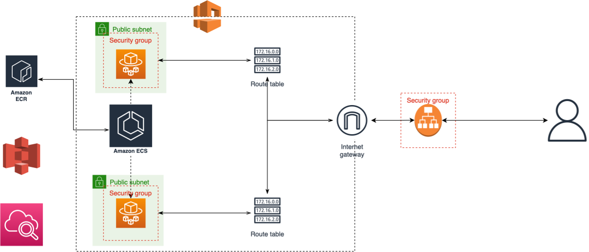

# Description

This repo is mainly about a demo to deploy a tensorflow model on [AWS ECS](https://aws.amazon.com/ecs/) and use api to call the model.

# Prerequisite
- terraform 
- tensorflow == 2.8.0
- python == 3.8
- fastapi

# Architect

That's how the infra architect looks like after run `terrafrom init` and `terraform apply` on the [`infra`](/infra) folder.
The step to build this infra:
* Create a `terraform.tfvars` file in [`infra`](/infra) folder and save your secret there
* Set up the VPC (vpc, Internet Gateway, route table, subnet)
* Set up the ECS cluster, define the ECS task and set up the ECS service
* Set up IAM role for the ECS task to grant it permission to access S3 and ECR
* Set up the Application Load Balancer to load traffic to ECS service in different subnet
* Set up the security group of ALB and ECS, only allow input traffic from ALB to be in the ECS service
* Set up a log group for debug and monitor what's inside the ECS service

# Reference
- [Create an AWS ECS Cluster Using Terraform](https://dev.to/thnery/create-an-aws-ecs-cluster-using-terraform-g80)
- [How to Deploy a Dockerised Application on AWS ECS With Terraform](https://medium.com/avmconsulting-blog/how-to-deploy-a-dockerised-node-js-application-on-aws-ecs-with-terraform-3e6bceb48785)
- [Create and manage an AWS ECS cluster with Terraform](https://www.architect.io/blog/2021-03-30/create-and-manage-an-aws-ecs-cluster-with-terraform/)
- [From Training to Serving: Machine Learning Models with Terraform](https://github.com/jzonthemtn/hashitalks2021-terraform-nlp)